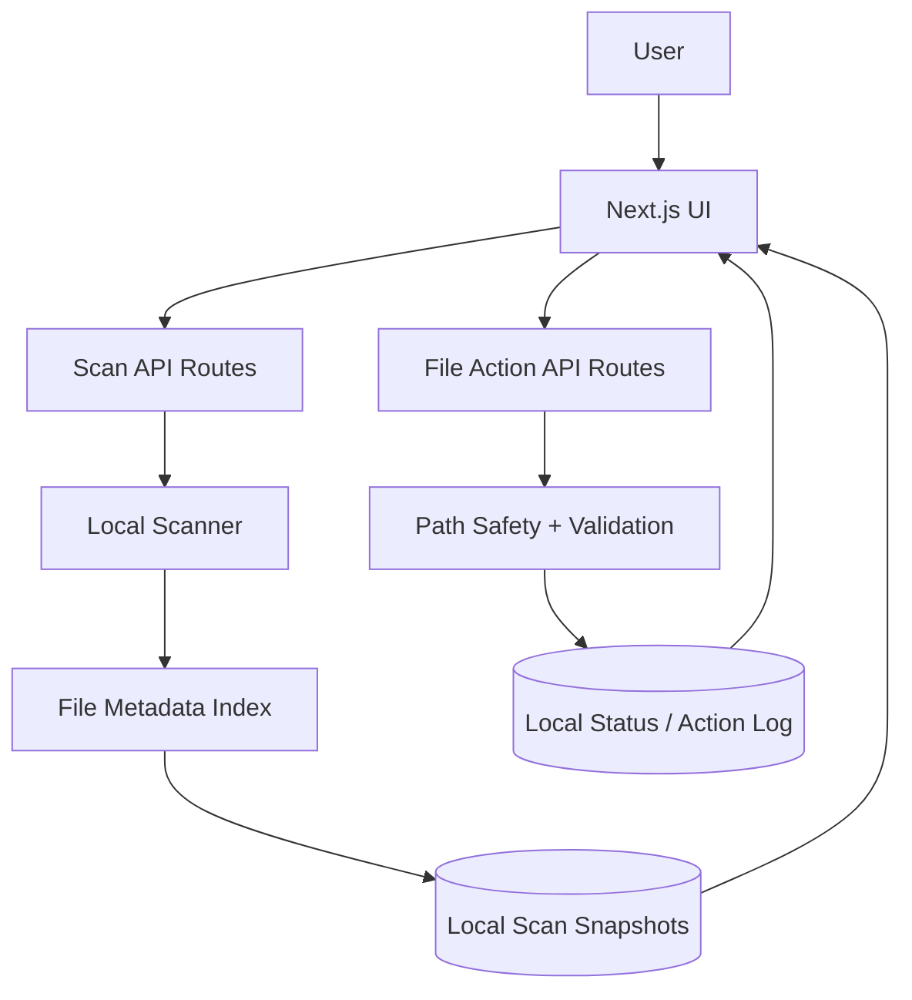

# Laptop Command Center

> A local-first dashboard for turning laptop storage chaos into searchable, prioritized cleanup workflows.

Laptop Command Center is a private productivity tool that scans local files, summarizes storage patterns, surfaces review queues, and helps users decide what to keep, archive, inspect, or remove. This public repository is a showcase version: it documents the product, engineering approach, and architecture without exposing the private application source code.

## Product Overview

Laptop Command Center gives a user a focused command center for their Mac. Instead of manually digging through Downloads, Documents, app support folders, cache folders, screenshots, installers, duplicate-looking files, and old school files, the app builds an indexed view of local storage and organizes cleanup work into practical queues.

The experience is built around fast scanning, clear storage summaries, safe review flows, and Finder-friendly actions.

## Why I Built It

Laptop storage cleanup is usually reactive and risky. The built-in file browser shows files, but it does not explain which items deserve attention, which folders are consuming space, or which documents are safe candidates for review.

I built this project to turn personal storage management into a structured workflow: scan, understand, triage, act, and review history.

## Problem It Solves

Modern laptops accumulate exported files, course documents, installers, screenshots, duplicate downloads, generated developer artifacts, caches, and forgotten large files. The hard part is not just finding big files. It is deciding what needs attention without accidentally touching important files.

Laptop Command Center solves this by combining local scan metadata, smart categorization, search, queue-based review, and guarded file actions.

## Target Users

- Students and professionals with messy Documents and Downloads folders
- Developers who accumulate local build artifacts and app support data
- Power users who want a safer alternative to ad hoc file cleanup
- Anyone who wants storage insight without uploading private files to a cloud service

## Core Features

- Local scan engine for common user storage locations
- Dashboard with review queues, storage snapshots, and scan warnings
- Document review workspace with status modes for `Needs Review`, `Keep`, and `Delete`
- Smart folders for old files, school-related files, repeated filenames, repeated PDFs, screenshots, installers, downloads cleanup, and large files
- Storage analytics for indexed categories, folder sizes, and app storage patterns
- Search drawer for indexed files, folders, apps, smart folders, and review candidates
- File action flows for revealing files, marking keep/delete candidates, returning items to review, and copying selected files into review folders
- Scan history with coverage, disk usage, and previous scan summaries
- Privacy-conscious local-first design

## Screenshots

Caption: Add a screenshot of the main dashboard showing review queues, scan status, smart folder summaries, and storage snapshot cards.

Caption: Add a screenshot of the Documents page with queue filters, selected file details, and keep/delete review modes.

Caption: Add a screenshot of the Smart Folders page showing folder categories and file-level actions.

Caption: Add a screenshot of the Storage page with indexed categories, large folders, and app storage summaries.

Caption: Add a screenshot of global search with filters for documents, downloads, large files, app support, caches, developer files, and review candidates.

Caption: Add a screenshot of scan history with latest scan metrics, disk usage trends, and scan coverage.

Caption: Add a screenshot of a confirmation modal for a guarded file action such as marking files as Keep or copying files to a review folder.

## Feature Walkthrough

1. The user opens the dashboard and sees whether the local scan is fresh.
2. A scan indexes local file metadata and summarizes storage across documents, downloads, application support, caches, media, archives, and developer-related artifacts.
3. The dashboard turns raw scan results into prioritized review queues.
4. The user can search, sort, filter, and inspect files before taking any action.
5. Smart folders group cleanup candidates by practical intent rather than raw path structure.
6. File actions are guarded by confirmation flows and status tracking.
7. History views make scan coverage and cleanup progress visible over time.

## Tech Stack

| Layer | Technology |
| --- | --- |
| Framework | Next.js 16 App Router |
| UI | React 19, TypeScript, Tailwind CSS |
| Icons | Lucide React |
| Charts / Visualization | Recharts |
| Runtime | Node.js |
| Data Model | Local JSON-backed scan and action state in the private app |
| Platform Assumption | Local macOS-focused file workflows |

## Architecture Overview

The private app uses a local-first architecture. The frontend renders dashboards, tables, queues, search, and confirmation flows. Server/API routes perform scan orchestration, file action validation, status updates, and retrieval of the latest scan state. Local persistence stores scan snapshots, file review status, and action history.

No working source code is included in this repository.

## Data Flow Overview

## Automation Components

Laptop Command Center does not depend on a cloud AI/ML service in the showcased implementation. Its automation comes from local indexing, heuristic categorization, scan refresh behavior, smart folder rules, review queue construction, and action history tracking.

## Engineering Highlights

- Local-first privacy model with no need to upload personal files
- Scan modes designed to balance responsiveness and depth
- Guarded file actions with explicit confirmation before status-changing workflows
- Smart folder logic that converts noisy file metadata into actionable review queues
- Search and filtering across multiple storage categories
- Defensive handling for partial scans, protected folders, stale scan data, and scan warnings
- Recruiter-friendly product surface backed by practical systems engineering concerns

## Security, Privacy, And IP Notice

This public repository is documentation-only. It intentionally excludes:

- Private application source code
- API keys, tokens, credentials, and environment files
- Private file paths, user data, scan output, and action logs
- Database schema details or proprietary data structures
- Copyable implementation logic for the private product

The private project remains proprietary. This showcase is intended for portfolio review, technical discussion, and recruiter evaluation.

## What I Learned

- How to design a local-first product around privacy-sensitive user data
- How to turn raw filesystem metadata into a usable cleanup workflow
- How to balance automation with user control for potentially destructive operations
- How to structure a dashboard for repeated operational use rather than one-time reporting
- How to document private work publicly without leaking implementation details

## Future Improvements

- More granular scan scheduling and background refresh controls
- Richer historical trend charts for cleanup progress
- Custom smart folder rules created from saved searches
- More advanced duplicate detection using content-aware fingerprints
- Exportable reports for storage audits
- Optional encrypted local backup of scan history and action logs

## Project Status

Private project. Public showcase repository only.

The application is actively represented here as a portfolio case study, but the working source code and private data are intentionally not included.
