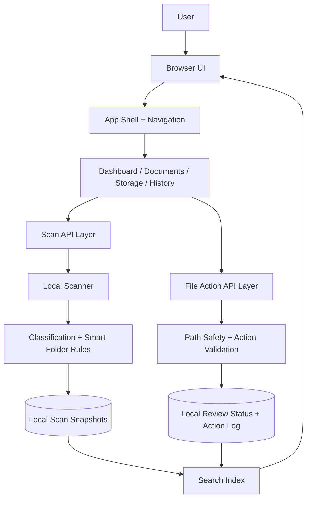

# Architecture

This document describes the public, high-level architecture of Laptop Command Center. It intentionally avoids private implementation details, exact internal schemas, private file paths, source code, and proprietary logic.

## System Overview

Laptop Command Center is a local-first Next.js application that scans local filesystem metadata, summarizes storage patterns, builds review queues, and exposes safe action workflows through a dashboard interface.

## Frontend Layer

The frontend is organized around an operational dashboard experience:

- Main dashboard for scan status, review queues, smart folder summaries, and storage snapshots
- Documents page for review modes, queue filters, sorting, selection, and file detail inspection
- Smart Folders page for grouped cleanup candidates and per-file actions
- Storage page for category-level and folder-level storage analysis
- History page for previous scan visibility and coverage summaries
- Search drawer for cross-category lookup

The UI favors dense, scannable controls because the product is meant for repeated workflow use rather than marketing presentation.

## Backend / API Layer

The private application uses server/API routes for local orchestration:

- Start or refresh scans
- Read the latest scan snapshot
- Read and update file review status
- Append action history
- Validate requested file actions
- Reveal files through the operating system where supported
- Copy selected files into review-oriented destinations

The API boundary keeps filesystem-sensitive operations out of the client UI and centralizes validation.

## Data Layer

The showcased project uses local persistence in the private implementation. Public docs do not expose the exact schema.

At a high level, the app stores:

- Latest scan snapshot
- Historical scan snapshots
- File review status
- Action log entries
- Derived smart folder and review queue summaries

The data layer is designed for local productivity workflows rather than multi-tenant SaaS storage.

## External APIs

The app is designed primarily around local machine data. It does not require a third-party storage provider for core functionality.

Potential external integrations could include:

- Operating system file reveal actions
- Optional backup or export destinations
- Optional analytics or reporting integrations in a future public product

## AI / LLM Services

No cloud AI/LLM service is required for the showcased implementation. The intelligence in this project comes from deterministic local scanning, metadata classification, review queue generation, and rule-based smart folders.

Future versions could explore optional local or privacy-preserving AI assistance for natural-language file search, cleanup explanations, or custom smart folder generation.

## Authentication And Security

The private app is local-first and intended for a trusted local user context. Security considerations include:

- Avoid exposing private file paths or scan data publicly
- Validate paths before file-oriented operations
- Treat delete-like operations as review status changes before destructive action
- Use explicit confirmation for bulk actions
- Keep scan and action state local
- Avoid uploading personal files or metadata by default

## Deployment Assumptions

The private implementation is assumed to run as a local web app on a user's machine. The showcase repository does not include deployment scripts, application source code, or production infrastructure details.

For a public product version, additional work would be needed around packaging, permissions, background execution, auto-updates, telemetry choices, and platform-specific security review.

## High-Level Data Flow

1. The user opens the dashboard.
2. The UI requests the latest scan state.
3. If scan data is missing or stale, the app can trigger a local scan.
4. The scanner walks configured local storage areas within bounded limits.
5. Metadata is categorized into storage categories, smart folders, review queues, warnings, and summaries.
6. The UI renders dashboard, search, storage, document review, smart folder, and history views from sanitized scan state.
7. When the user takes an action, the API validates the target and updates local review status or action history.
8. Updated state is reflected back into the UI.

## Privacy Boundary

This public architecture description does not include:

- Exact private scanning rules
- Internal TypeScript types
- Local JSON schema
- Private data samples
- Private user paths
- Source files
- Secret values or environment configuration
